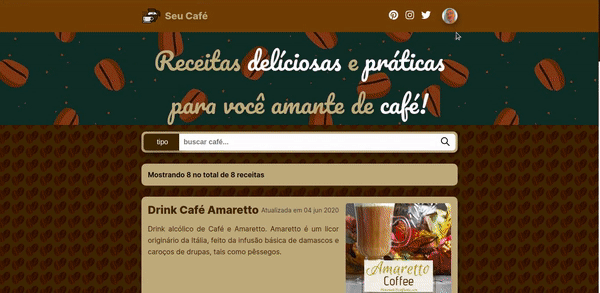
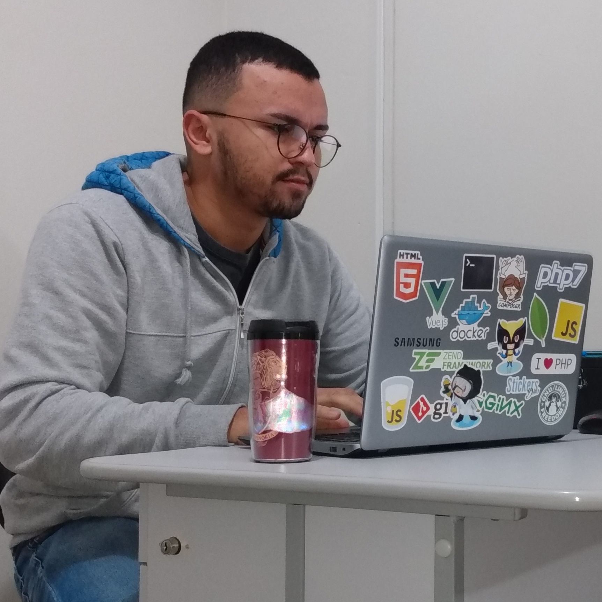

# :coffee: Seu Café

Este projeto é para você amante de café como eu! A aplicação foi construída inteiramente com React + TypeScript e tem a proposta de ser um repositório das mais diversas receitas de café. Você pode gerenciar receitas que mais te agradam além de descobrir muitas outras!

  

## :question: Por que?

Esta aplicação foi construida fundamentalmente para estudar a lib ReactJS abordando TypeScript como linguagem além de adicionar funcionalidades de logout automático, upload de imagens e fundamentos de SPA.

Esta aplicação também faz parte de um compilado de estudos sobre o ecossistema JS, que aborda aplicações cross-platform (mobile), web e servidor.

Você pode ver a API deste projeto acessando este [link](https://github.com/thalysonalexr/ycoffee-api)

E a aplicação em React Native acessando [este](https://github.com/thalysonalexr/ycoffee-mobile)

## :blossom: Layout

Parte desse estudo também visa a prototipação das aplicações com Figma. [Veja aqui o protótipo.](https://www.figma.com/file/2xaJA3x3lYY3GDC01lcL2e/website?node-id=98%3A61)

## :rocket: Tecnologias

- React Native
- React Navigation
- TypeScript
- Expo

---

## Desenvolvido com :heartbeat: por [Thalyson Rodrigues](https://www.linkedin.com/in/thalysonrodrigues/)

<table>
  <tr>
    <td align="center">
      <a href="">
        
         
        <b>Thalyson Rodrigues</b> 
        Developer/Engineer
      </a>
    </td>
</table>

## Licença MIT

Lançado em 2020. Este projeto está sob a [licença MIT](https://github.com/thalysonalexr/ycoffee-web/blob/master/LICENSE)
